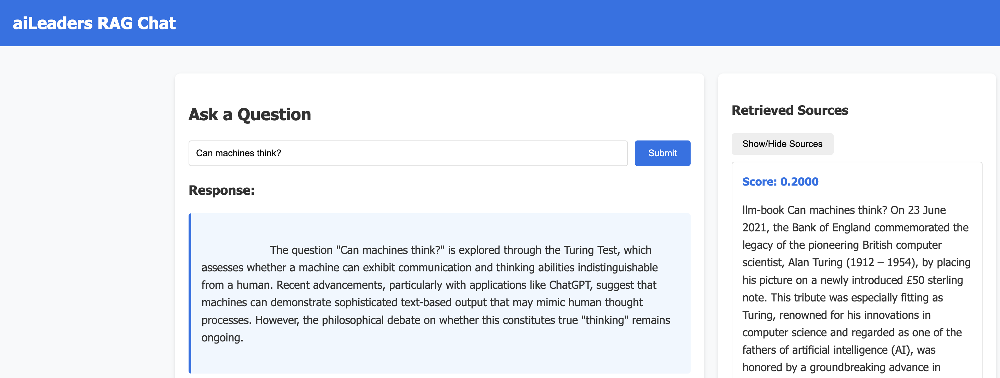

# RAG Application

Ask AI leadership questions. Check your understanding and refine existing knowledge.



## Features
- Generate responses using an LLM based on document context
- View relevant chunks used to contextualize LLM response
- Generates JSON log files in the project directory /logs

## Prerequisites
- Python 3.8 or higher
- Ragie.ai API key **(email me)**
- OpenAI API key **(email me)**

**NOTE: .env.example is a template. You will need my keys and then remove .example
from the file name.**

## Installation
### Step 1: Set Up Your Environment

Create a directory for the project and set up a virtual environment:

#### For macOS/Linux:
```bash
# Create a project directory
mkdir rag-project
cd rag-project

# Create a virtual environment
python -m venv --prompt ask-aiL .venv

# Activate the virtual environment
source .venv/bin/activate
```

#### For Windows:
```bash
# Create a project directory
mkdir rag-project
cd rag-project

# Create a virtual environment
python -m venv --prompt ask-aiL .venv

# Activate the virtual environment
.venv\Scripts\activate
```

### Step 2: Clone the Repository

**NOTE**: if you've already configured an SSH key for your GitHub profile and current device, skip to step 2c

#### Step 2a: Generate SSH key
Using the link below, complete sections **Generating a new SSH key** and **Adding your SSH key to the ssh-agent**

 <https://docs.github.com/en/authentication/connecting-to-github-with-ssh/generating-a-new-ssh-key-and-adding-it-to-the-ssh-agent>


**NOTE**: Save the key in the default location. It is not necessary to create a passphrase, but ensure you remove the `UseKeychain` line
from the `/.ssh/config` file if you omit the passphrase.

#### Step 2b: Add the SSH public key to your GitHub account
Using the link below, complete the section **Adding a new SSH key to your account** 

<https://docs.github.com/en/authentication/connecting-to-github-with-ssh/adding-a-new-ssh-key-to-your-github-account>


#### Step 2c: Clone the repo using SSH
- Go to the main repo <https://github.com/sstrickland85/ask-aiL>
- Select the Code dropdown (**green button**), select SSH, and copy the URL to clipboard
- In terminal, navigate to the project directory from step 1
- Run the `git clone` *pasted_url* to clone the repo e.g.:
```bash
cd /Users/home_dir/rag-project
git clone git@github.com:username/private-repo.git
```

### Step 3: Install Dependencies

```bash
pip install -r requirements.txt
```

## Usage

With your virtual environment activated, run the application:

```bash
python start_app.py
```
## Future Enhancements

- Document management features
- Support for local LLM implementations

## Troubleshooting

- **ImportError or ModuleNotFoundError**: Make sure your virtual environment is activated and all dependencies are installed
- **API Key Errors**: Verify that your `.env` file exists and contains valid API keys
- **URL Errors**: If you encounter endpoint errors, check with the API provider for the correct URLs

## Project Structure

- `start_app.py`: Entry point for the application
- `config.py`: Configuration and environment variables
- `rag/`: Main application package
  - `clients/`: API client implementations
  - `app.py`: Core RAG application logic
- `.env.example`: Example environment variable file
- `requirements.txt`: Required Python packages